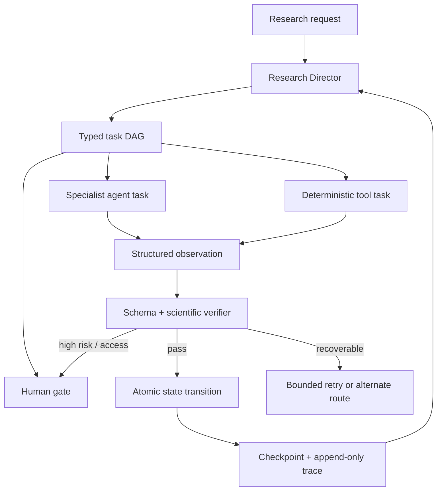

# Agent Framework Benchmark for Research OS

调研日期：2026-09-09。以下比较基于各项目官方文档或官方仓库的当前公开架构；它是设计输入，不是依赖选择或能力认证。外部项目快速变化，实际集成时必须锁定版本并重新运行兼容测试。

## Runtime frameworks

| 项目 | 可借鉴机制 | 对 Research OS 的适配 | 不直接复制的部分 |
| --- | --- | --- | --- |
| [OpenAI Agents SDK](https://openai.github.io/openai-agents-python/) | Agent/Runner loop、function tools、agents-as-tools、handoffs、guardrails、sessions、HITL interruption、MCP、tracing；[运行文档](https://openai.github.io/openai-agents-python/running_agents/)明确描述模型—工具—再调用循环，[HITL](https://openai.github.io/openai-agents-python/human_in_the_loop/)支持序列化 RunState 后批准/恢复，[sandbox agent](https://openai.github.io/openai-agents-js/guides/sandbox-agents/concepts/)区分 manifest/workspace/session/saved state | 优先候选 adapter：Director 作为 manager，specialists 可作 tools 或 handoff；外部工具走 MCP；trace 与本项目 artifact lineage 关联 | 不让 SDK session 成为研究事实唯一存储；不允许 guardrail 文字替代证据和识别验证 |
| [LangGraph](https://docs.langchain.com/oss/python/langgraph/overview) | StateGraph、持久 checkpointer、thread state history、interrupt/Command resume、replay/time travel；[interrupt](https://docs.langchain.com/oss/python/langgraph/interrupts)强调恢复时节点会重跑，副作用必须幂等；[persistence](https://docs.langchain.com/oss/python/langgraph/persistence)保留 checkpoint history | 适合长期、有条件分支的研究 DAG；可把 ResearchState 映射为 graph state，把人工门作为 interrupt | 不将框架 reducer 或 thread state 与证据卡、执行回执混为一体；避免为简单线性任务引入复杂图 |
| [Microsoft Agent Framework](https://learn.microsoft.com/en-us/agent-framework/) | sequential/concurrent/group-chat/handoff orchestration、middleware、OpenTelemetry、HITL；官方 [workflow checkpoints](https://learn.microsoft.com/en-us/agent-framework/workflows/checkpoints)在 super-step 后捕获完整状态并支持恢复 | 适合 .NET/Python 组织内运行和显式 workflow；其 middleware/observability 模式可借鉴到权限、审计和成本层 | 当前核心不绑定单一云、单一模型 provider 或其 workflow serialization |

## Agent–Computer Interface

| 项目 | 观察 | Research OS 采用 |
| --- | --- | --- |
| [OpenHands](https://github.com/OpenHands/OpenHands) | 把 agent、workspace、sandbox/runtime、terminal/file/edit tools 分层；其 [Docker sandbox](https://docs.openhands.dev/sdk/guides/agent-server/docker-sandbox)体现环境隔离 | 每个工具声明 workspace、权限、输入输出、超时和副作用；公开数据运行与受限数据运行使用不同 execution profile |
| [mini-SWE-agent](https://github.com/SWE-agent/mini-swe-agent) | 小核心、环境接口、结构化命令结果；本地环境实现返回 command、return code 和 output | 科研命令统一 ToolResult：status、stdout/stderr 摘要、return code、artifacts、hash、environment、error class |
| [SWE-agent](https://github.com/SWE-agent/SWE-agent) | Agent–Computer Interface 约束 action 格式，工具 handler 管理解析、重试和环境反馈 | PDF/Zotero/browser/data/engine/LaTeX/Git 各自拥有窄工具面；拒绝任意 cookie 导出和无边界 shell |

科研 ACI 与代码 ACI 的差异是：命令成功不等于研究结论成立。Research OS 在 computer observation 之外还要求 evidence verifier、identification gate 和 numerical lineage。

## Research agents

| 项目 | 强项 | 局限或风险 | Research OS 选择 |
| --- | --- | --- | --- |
| [PaperQA2](https://github.com/Future-House/paper-qa) | 面向科学论文的 agentic RAG、文档索引/缓存、检索—重排—上下文化摘要—回答、带出处回答 | RAG citation 不自动等于阅读全文或 claim entailment | 复用索引与分步检索思想；included corpus 仍要求全文状态、locator 和人工可复查证据卡 |
| [GPT Researcher](https://github.com/assafelovic/gpt-researcher) | Planner 生成子问题、并行 execution agents 搜集、publisher 汇总、来源跟踪，支持本地文档与 tracing | 大量并行角色可能重复、割裂全篇；网页来源质量需另行控制 | 保留 Director—specialist 少量并行和单一 evidence registry；最终全篇 verifier 防止 section silo |
| [codex-paper-workflow](https://github.com/shuohui-air-technology/codex-paper-workflow) | 编辑部角色、阶段门、事件日志、progress manager、有限并行 | 核心仍是 Codex skill/prompt controller，runtime durability 依赖宿主 | 吸收阶段收据和 bounded delegation；用独立 ResearchState 把协议变成可测试状态机 |
| [academic-research-skills](https://github.com/zhangjiazhe/academic-research-skills) | 多项学术 skills、next-action 辅助、研究过程覆盖广 | skill 广度不自动形成持久 agent loop | 维持 specialist skills 的可复用性，但不继续用 skill 数量代表 agent 能力 |
| [AI-Scientist](https://github.com/SakanaAI/AI-Scientist) | idea generation、实验迭代、结果评审和论文生成构成 research loop | 开放式自主选题/实验不适合高风险社会科学研究；自动审稿不能取代研究者责任 | 只借鉴 experiment loop、cost/attempt records 和 verifier placement；问题、设计、数据伦理、主要结果与投稿保留人工门 |

## 提取出的最小架构模式

最小模式由九项组成：

1. 框架中立的 canonical ResearchState，而不是把聊天记录当数据库；
2. 有类型、依赖、owner、验收条件和重试上限的任务 DAG；
3. 观察结果驱动的受约束重规划；
4. 每次 transition 后原子 checkpoint 与追加式 event；
5. 外部副作用使用幂等键、执行回执和事后核验；
6. specialist agent 与 deterministic tool 分离；
7. deterministic validator 与独立科学 verifier 分离；
8. human interrupt 是一等状态，不是失败或聊天备注；
9. trace/evaluation 以可验证 artifact 为单位，不以“模型说完成”为单位。

## 框架决策

核心层暂不选择唯一上游框架。`research-state/1.0`、event log、DAG 和 tool contracts 使用普通 JSON/Python；未来 adapter 可以选择 OpenAI Agents SDK 作为默认模型运行器，以 LangGraph 承载特别长或多分支的 durable workflow，或在 Microsoft 环境接入 Agent Framework。任何 adapter 都必须证明：

- restart 后 ResearchState 与外部副作用不丢失、不重复；
- pause/resume 不绕过人工门；
- tool call 与 artifact hash 可关联到 trace；
- provider state 可丢弃，而研究证据与执行事实仍可恢复；
- adapter 失败不会把未完成任务写成 complete。
