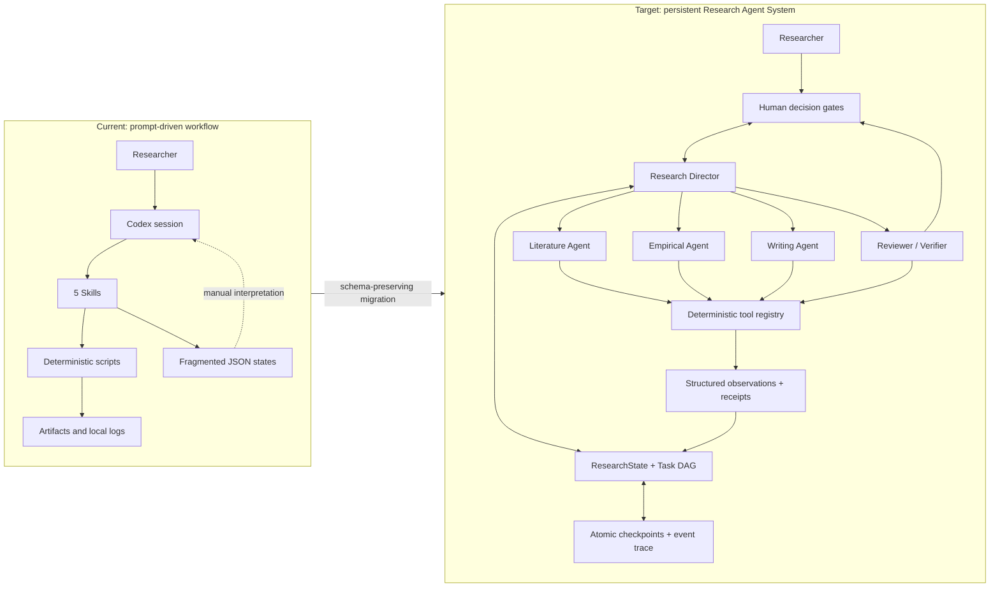

# Research OS Agent Runtime Gap Analysis

> 2026-09-10 update: the v0.9 gaps for explicit outcome classification, bounded strategy replanning, dynamic review feedback, four memory layers, structured scientific guardrails, independent verifier context, unified tool manifests, and pause/resume/reconstruct have been implemented in v0.10. Remaining gaps concern production model adapters, production certification of staged external tools, distributed locking, and large-scale evaluation. See `docs/agent-runtime-v0.10.md`.

审计日期：2026-09-09。审计范围包括 `AGENTS.md`、根目录说明、五个 `SKILL.md`、其 references/scripts、根目录 schemas/scripts/config/examples/docs。结论只描述已存在且可验证的能力，不将提示词中的角色设定算作已经运行的 Agent。

## 执行摘要

v0.8.0 是一个设计成熟的 **Research OS workflow / skills collection**，但不是一个完整 Agent runtime。它已经把真实性、全文证据、数值血缘、软件执行回执、人工审批和失败交接写成了强规范，并提供了一批确定性脚本；不足在于这些规范由 Codex 会话或用户手工推进，缺少统一的持久状态、运行循环、动态任务图、观察后重规划、统一恢复语义以及跨阶段 trace/evaluation。

v0.9.0 的目标不是让系统无限自主，而是加入一个可审计的最小运行内核：Research Director 管理目标和状态，四个 Specialist Agents 处理需要多轮判断的任务，确定性 Tools 执行外部动作，Reviewer/Verifier 与人工门共同决定是否继续。

## 组件分类

| 当前组件 | 分类 | 依据 | 不是什么 |
| --- | --- | --- | --- |
| `skills/*/SKILL.md` 与 references | Skill | 可复用的任务说明、边界、输入输出与判断协议 | 不是常驻进程或运行循环 |
| `scripts/workflow.py`、下载校验、OA 解析、Zotero 脚本、实证桥、论文审计器 | Tool | 接受参数、产生结构化结果或副作用，核心路径可确定性执行 | 不是自主规划者 |
| `economics-paper-workflow` 的九阶段生命周期 | Workflow | 预先定义阶段、门和交付物，并路由四个 specialist skills | 不是根据 observation 动态生成并执行的 DAG |
| 七角色综述 panel、Lead/Curator 协议 | Agent-like behavior | 有角色目标、责任、交接与争议处理规则 | 主要停留在 prompt-level orchestration；没有统一身份、会话、调度器和执行记录 |
| `economics-paper-project`、`review-run-status`、`workflow-run`、实证 `checkpoint.json` | Fragmented state | 能保存项目或单一工作流的部分状态 | 不是全项目统一、原子、可迁移的运行状态 |
| `audit_paper.py`、Schema 验证、哈希核验、跨引擎比较 | Deterministic verifier | 可复查结构、引用键、数字来源、文件和运行一致性 | 不是独立的科学审稿 Agent，也不能自行证明因果识别 |
| README/AGENTS 路由规则 | Prompt-level orchestration | 由宿主模型读取后选择 skill 并按文字协议推进 | 不能在进程重启后独立恢复 |

## 运行能力审计

| 问题 | v0.8.0 判断 | 证据与缺口 | v0.9.0 最小响应 |
| --- | --- | --- | --- |
| 真正 agent loop | 否 | 没有 `model → action → observation → state transition → next action` 的运行器 | `ResearchRuntime.run()` 按状态选择 ready task，执行/委派并在每次 transition 后持久化 |
| workflow state 持久化 | 部分 | 多个 schema 与项目文件分别保存，不存在单一 source of truth | `research-state/1.0` 作为控制平面；专业事实仍由旧 schema 文件权威保存 |
| checkpoint / resume | 部分 | 实证脚本有原子 checkpoint；综述有协议性 checkpoint；语义不统一 | 每次 transition 写不可覆盖 checkpoint 与追加式 event；同一 run directory 可恢复 |
| tool observation → replanning | 否 | 工具输出交给宿主模型解释，没有受约束的重规划接口 | observation 可返回 `next_tasks`；只允许规定 kind/owner，通过无环验证后加入 DAG |
| 动态任务 DAG | 否 | 阶段顺序主要固定且由提示词解释 | task 有依赖、状态、owner、验收条件与重试上限；新任务自动成为 final gate 的依赖 |
| 失败恢复 | 部分 | 若干脚本拒绝覆盖并保存失败；没有统一 retry/blocked/handoff 状态机 | 有界重试、错误记录、waiting-human/blocked 与恢复命令；不静默丢失失败 |
| agent delegation | 协议层 | 七角色 assignment packet 仅在支持子专家的宿主中生效 | 五角色目录、结构化 delegation packet 与 observation contract；模型适配器仍是显式边界 |
| verifier | 部分 | 确定性 audit 强；科学审阅仍由提示词角色承担 | Reviewer/Verifier Agent + deterministic firewall；二者均不能替代最终人类批准 |
| tracing | 部分 | 有日志、哈希、运行回执，无统一 run/task/event 链 | `events.jsonl`、tool/agent run registry、artifact hash、parent run 与 checkpoint chain |
| evaluation | 部分 | 单元测试与若干公开复现；没有 runtime transition/e2e eval | 新增状态机测试；下一阶段增加基准任务、恢复成功率和证据错误率评估 |

## Current Architecture → Target Architecture

## 目标职责边界

### Research Director Agent

拥有研究目标、任务图、当前阶段、冲突协调和完成判定。它可以拆分任务、选择 specialist、在失败后改变合法路线，但不能自行批准研究问题、识别设计、样本规则、主要结果、外部上传或投稿。

### Specialist Agents

- Literature Agent：检索计划、全文阅读、证据综合；不得把摘要或题录冒充全文证据。
- Empirical Agent：数据诊断、estimand、识别、模型 specification 与执行解释；不得按显著性改设计。
- Writing Agent：只从已批准证据和数值 artifact 写 LaTeX；不得补造引用或结果。
- Reviewer / Verifier Agent：独立挑战 evidence entailment、识别、数值和交付完整性；不负责改写被审对象。

### Deterministic Tools

Zotero、CNKI browser、OpenAlex、Crossref、Unpaywall、filesystem、PDF parser、Python、Stata、R、LaTeX compiler、Git 和 schema validator 保持工具身份。它们有参数、权限、超时、输出 schema、幂等键、回执和错误分类；只有确实需要独立目标、多轮判断与自主分解时才升级为 Agent。

## v0.9.0 实现边界

本版本建立的是可运行的 **framework-neutral agent kernel**，不是声称已经接通所有模型和外部工具的无人研究系统。它具备状态、DAG、委派包、观察、重规划、重试、checkpoint/resume、trace 和 human interrupt；真实 LLM 执行由宿主或未来 adapter 完成，并通过 observation schema 回写。这样可以测试状态机而不把 API Key、浏览器会话或软件许可证绑定到核心模型。

## 下一阶段验收条件

1. 为 OpenAI Agents SDK、LangGraph 或 Microsoft Agent Framework 实现至少一个可选 adapter，但 ResearchState 继续框架中立。
2. 为 Zotero、CNKI、OA resolver、Python/Stata/R、LaTeX 与 Git 建立统一 ToolResult 和幂等策略。
3. 用一个文献项目和一个实证项目做断网、进程重启、重复副作用、人工拒绝和 verifier 失败的端到端测试。
4. 增加 evaluation：任务完成率、恢复成功率、重复下载/导入率、无证据 claim 率、数字 lineage 通过率和人工纠错次数。
