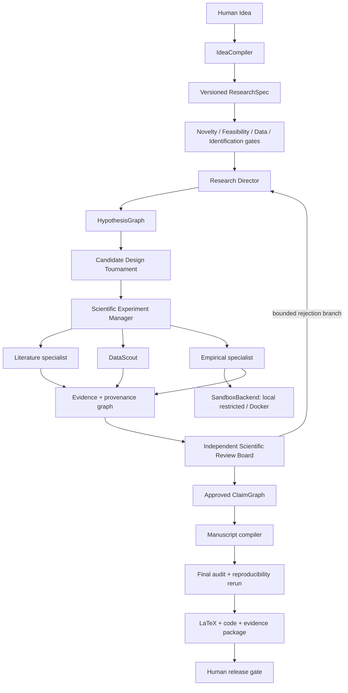

# Research OS v1 Autonomous Research Architecture

Status: target architecture, 2026-09-18. This document is a design contract, not a claim that v1 exists.

## Scientific objective and boundary

Research OS should eventually accept a short human research idea and autonomously advance lawful, bounded work through validation, evidence, design, execution, review, writing and reproducibility. Canonical scientific state remains in framework-neutral schemas, artifacts, hashes, receipts and `ResearchState`; an SDK session, model transcript or provider memory can be discarded without losing scientific facts.

Human gates remain mandatory for ethics/IRB, restricted-data access, credentials/CAPTCHA, confirmatory design changes, irreversible external action, submission and release. Statistical significance, preferred sign and effect magnitude are never branch-selection objectives.



## Stable v0.11 kernel retained

The following remain canonical and are extended rather than replaced: `ResearchState`, typed dynamic DAG, file/SQLite `StateBackend`, `ScientificMemoryStore`, `ContextPacker`, `EvidenceVerifier`, Tool Registry, idempotency records, artifact hashes, local traces, checkpoint/recover, bounded planning and Worker/Verifier separation. The five Skills remain domain policies/SOPs; they are not proof of task completion.

## New control-plane components

1. **IdeaCompiler / ResearchCompiler** produces a versioned `ResearchSpec` and multiple candidate designs. Model output is only a proposal; deterministic validation and human policies control admission.
2. **Validation gates** separately assess novelty, feasibility, data availability and identification. “No result found” is never sufficient evidence of novelty.
3. **Scientific Experiment Manager** operates a bounded social-science experiment tree. Legal branch types are alternative identification, measurement, diagnostic, falsification, robustness, mechanism, heterogeneity, replication and data-quality investigation.
4. **SpecificationRegistry** freezes confirmatory outcomes, treatment, sample, bandwidth, controls, fixed effects, standard errors, weights and outlier rules. Later analyses are exploratory unless explicitly promoted with a versioned diff and approval.
5. **DataScout** discovers lawful datasets, checks license/version/unit/year/variables/merge keys, registers immutable raw bytes and emits `DATA_ACCESS_REQUIRED` rather than bypassing access restrictions.
6. **Provenance graph** links `RawDataset → Transformation → AnalysisDataset → Code → ModelRun → Estimate → Table/Figure → NumericClaim → ManuscriptClaim` and supports backward tracing.
7. **SandboxBackend** mediates generated-code execution. Host shell is not the default research tool.
8. **Scientific Review Board** uses artifact-only Literature, Identification, Statistical, Reproducibility and Writing/Claim reviews. Rejection creates a bounded, typed replan branch.
9. **ClaimGraph** classifies background, literature, descriptive, empirical, causal, mechanism, limitation, interpretation and speculation claims, each with a separate evidence contract.

## Experiment selection contract

Allowed branch scores are identification validity, evidence quality, robustness, reproducibility, novelty, feasibility, information gain, assumption risk, specification fragility and cost. The planner schema must reject `p_value`, `significance`, `preferred_sign` and `effect_magnitude` as search objectives. Negative and null findings are ordinary results, not tool failures.

## Execution and recovery

```text
GOAL → PLAN → ACT → OBSERVE → VERIFY → CRITIQUE → REPLAN
     → EXECUTE → SYNTHESIZE → REVIEW → REVISE → FINAL AUDIT
```

Routine syntax/package/model/data errors return structured observations to the originating specialist and consume a bounded repair budget. Permission failures, credentials, access controls, ethics, hard budgets and unresolved scientific ambiguity create human gates. Every task and experiment branch declares attempts, time/cost limits, success/failure contracts and stopping conditions.

## Mechanisms borrowed, not architectures copied

- AI-Scientist-v2 motivates bounded multi-branch experiment exploration and debug depth, but its ML benchmark optimization objective is rejected for social science. It also illustrates why step-level journals and summaries must be checkpointed rather than deferred.
- Agent Laboratory motivates the real literature–experiment–writing loop, while Research OS adds canonical state and evidence gates.
- data-to-paper motivates backward trace and replay; JSON artifacts remain portable while SQLite indexes relations.
- PaperQA2 motivates metadata-aware retrieval, reranking, contextual evidence and contradiction detection; a retrieved passage still does not equal verified full-text entailment.
- STORM/Co-STORM motivates perspective-guided questions and alternative viewpoints; it does not replace systematic evidence screening.
- GPT Researcher motivates planner/executor separation and parallel research, but evidence identity and full-text rules remain stricter.
- OpenHands and SWE-agent motivate workspace/sandbox/ACI separation and explicit command observations.

Primary references: [AI-Scientist-v2](https://github.com/SakanaAI/AI-Scientist-v2), [Agent Laboratory](https://github.com/SamuelSchmidgall/AgentLaboratory), [data-to-paper](https://github.com/Technion-Kishony-lab/data-to-paper), [PaperQA2](https://github.com/Future-House/paper-qa), [STORM](https://github.com/stanford-oval/storm), [GPT Researcher](https://github.com/assafelovic/gpt-researcher), [OpenHands](https://github.com/OpenHands/OpenHands), and [SWE-agent](https://github.com/SWE-agent/SWE-agent).

## Proposed module and schema map

| Increment | Proposed modules | Schemas/artifacts | Release target |
|---|---|---|---|
| Production execution | `research_os/sandbox.py`, adapter certification, long-run recovery | sandbox execution receipt | v0.12 |
| Research compilation | `research_os/compiler.py`, `validation.py`, `data_scout.py` | ResearchSpec, candidate design, validation receipts | v0.13 |
| Experiment manager | `research_os/experiments.py`, `specifications.py` | experiment tree, AnalysisPlan, SpecificationRegistry | v0.14 |
| Manuscript system | `research_os/claims.py`, extended provenance/review | ClaimGraph, review-board receipts, release manifest | v0.15 |
| Autonomous certification | public idea-to-paper benchmark suite | frozen thresholds and final reproducibility package | v1.0 |

Only the first v0.12 slice is implemented in the current development changes. Later rows remain proposed.
