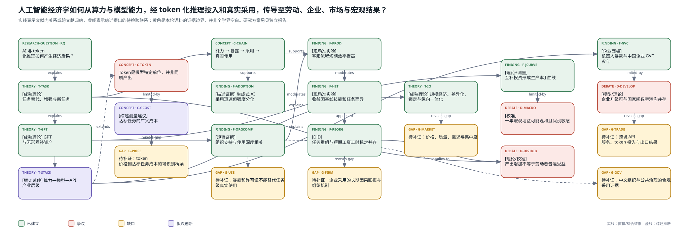

# 从人工智能经济学到 Token 经济学：研究进展、核心争论与研究边界

## 一、范围与主要判断

人工智能经济学已经从“机器会不会替代劳动”的单一问题，扩展为连接任务生产、企业组织、市场竞争、知识创新、宏观增长和国际分工的研究体系。但是，技术能力的快速提高，并不意味着这些层面的经济后果已经被同等充分地识别。目前相对清楚的是特定工作流程中的生产率变化；更不确定的是长期就业、企业间再配置、收益分配和一般均衡福利。

本文所说的 token 不是加密资产，而是语言模型处理内容时使用的计量单位。在商业服务中，它也常是推理使用量的计费单位。“Token 经济学”因此不是人工智能经济学的同义词，而是研究推理投入、价格、任务质量、人工复核和经济价值之间关系的新切入点。不能因为 token 可以计数，就将其当作同质算力、有效劳动或价值增加。

本轮采用中英文主题性综述，而非声称穷尽全部数据库的系统评价。检索和资料版本主要截至2026年9月3日，9月4日完成续跑整理。正文使用已核验的经典理论、中文全文及四篇近期研究；没有取得真实全文的最新论文不承担实质发现。七篇综述和综合章节用于学习问题导向、机制比较和层级转换的写法，其中多篇来自同一论文集，不能将它们视为七项独立的经验证据。

## 二、共同理论框架：技术能力不等于经济效果

理解AI经济后果，首先要区分五个环节：**技术能力—任务暴露—组织采用—实际使用—经济结果**。模型能完成某项测试，只说明技术可能性；职业暴露指数描述岗位任务可能受影响的程度；购买账号或部署软件也不等于员工真正把它用于生产。只有把实际调用、任务重新分配和结果连接起来，才能讨论经济收益。陈永伟（2018）的综述已经区分AI作为研究工具与研究对象；生成式AI的发展进一步提高了这种概念区分的重要性。

任务模型提供了第一条理论主线。Acemoglu与Restrepo（2018）区分机器替代既有劳动任务和创造劳动具有比较优势的新任务：两者都可能提高产出，却对劳动需求和收入份额产生不同影响。因此，AI“增强劳动”或“替代劳动”不是模型本身固定不变的属性，而取决于具体任务、相对成本、需求扩张和新任务形成。自动化写作可能减少初稿劳动，同时增加审核、整合和客户沟通；职业由任务组合构成，不能将任务暴露比例直接换算为失业比例。[原文](https://doi.org/10.1257/aer.20160696)

第二条主线是通用目的技术与互补投资。Brynjolfsson、Rock和Syverson（2019；2021）强调，技术潜力转化为生产率需要流程重构、培训、软件、数据和管理等无形资本。导入初期，这些投入形成成本，而收益可能延后出现，构成生产率J曲线。这既解释了局部技术突破为何可能与总量生产率平淡并存，也提醒研究者：滞后收益是一种有条件的机制，不是所有失败采用必将成功的保证。[原文](https://doi.org/10.1257/mac.20180386)

第三条主线区分AI在普通生产与知识生产中的作用。Aghion、Jones和Jones（2019）讨论了任务自动化、思想生产及人类密集环节的瓶颈。AI加速检索、组合和生成，不等于自动产生被验证、可实施且有经济价值的新知识；增长率是否永久提高，取决于知识生产函数、必要投入和扩散条件，而不是输出文本数量。[原文](https://www.nber.org/chapters/c14015)

## 三、劳动与生产率：从“能否提高效率”到“谁受益、在哪里有效”

生成式AI使研究从技术暴露测算进入真实使用的观察。Brynjolfsson、Li和Raymond的客服研究利用工具分批上线和运营记录，发现助手访问与每小时解决问题数量提高有关，新手和初始技能较低者受益更大。本文核验的是2023年11月修订的NBER版本，其中平均增幅约14%；不能把这一数值未经核对地视为最终期刊版本的相同估计。该研究支持知识扩散和经验获取的解释，但不是对所有行业、工资或总就业的随机实验。[已读版本](https://www.nber.org/papers/w31161)

这一类证据改变了技能偏向的讨论。AI可能补充经验不足者缺少的知识，也可能增加领域判断、核验和责任承担的价值。短期绩效差距缩小不意味着长期工资差距必然缩小：工资还取决于劳动力供求、议价能力、技能形成和企业对收益的占有。研究应同时测量速度、平均质量、严重错误、返工和学习，不能只以“更快”定义生产率。

采用广度与使用深度也不相同。Bick、Blandin和Deming（2024，2025年2月修订）用美国代表性调查记录生成式AI扩散：截至2024年末，接近四成18—64岁成年人报告使用过生成式AI，但工作中受到AI辅助的工时占比仍明显小于使用者比例。其时间节省属于自报结果，不是经随机对照识别的总量生产率增幅。研究的重要贡献是把是否使用、使用频率和工时强度分开。[原文](https://www.nber.org/papers/w32966)

Humlum与Vestergaard（2025，2026年3月修订）将丹麦采用调查与行政劳动记录连接起来，发现组织和任务调整已经出现，但在其观察窗口与差分设计下，平均收入和记录工时的效应接近零。该结果并不否定某些任务的效率改善，而是说明组织可能先通过新任务、复核、整合和岗位调整吸收技术变化，之后才反映到收入和工时。采用并非随机、样本集中于丹麦受影响职业，因此也不能将早期零结果解释为全球长期无影响。[原文](https://www.nber.org/papers/w33777)

这些研究之间最重要的关系不是“乐观派与悲观派相互矛盾”，而是估计单位和时间尺度不同：任务效率、企业流程和劳动市场结果之间，需要经过需求、组织重构和再分配。下一阶段的重要问题是这些中间环节何时成为约束，以及技术收益最终由劳动者、企业还是消费者获得。

## 四、企业与产业组织：采用成本、组织互补和收益归属

企业采用AI是一项投资决策，不是模型能力提高后的自动反应。除API账单外，企业还承担数据准备、系统集成、培训、复核、安全、合规和失败风险。固定采用成本较高时，降低token价格可能主要增加已有用户的使用深度，而不会显著扩大采用者数量。这是由互补投资理论推出的待检验命题，不能当作本轮已经识别的经验结论。

Varian（2019）将机器学习服务供给与采用行业放入产业组织框架，讨论数据、规模、企业边界和定价。大模型时代需要进一步区分芯片与能源、云、基础模型、推理接口、应用和企业工作流：应用开发门槛下降可以与上游集中同时发生；开放模型增加供给也不自动消除托管、分发、专有数据和切换成本造成的市场权力。[原文](https://www.nber.org/chapters/c14017)

因此，企业研究至少有三类可分离问题：谁采用，以及为何采用；采用后是否重新分配任务、决策权和人工审核；效率收益是否通过降价、扩产或新产品传导出去。专利、招聘、投资和真实调用分别测量不同环节，不能混合为一个“AI指数”后赋予统一因果解释。对数字经济研究而言，连接技术日志与组织结果，比继续增加宽泛的采用虚拟变量更有解释力。

## 五、创新、宏观增长与分配：微观收益如何聚合

宏观研究的核心争议在于聚合条件，而不是是否承认AI具有潜力。任务成本下降需要乘以真正受影响的任务份额和采用强度，再考虑资本、需求、新任务和部门瓶颈。Acemoglu《The Simple Macroeconomics of AI》的2024年NBER版本给出相对温和的十年TFP情景，强调容易学习的任务证据不能无条件推广到高语境、难反馈任务。这属于依赖参数和结构的校准，不是对未来GDP的已验证预测。[已读版本](https://www.nber.org/papers/w32487)

与此相对，知识生产理论允许AI通过研发和思想生产改变更长期增长，但这种结果依赖对瓶颈、可自动化程度和创新回报的假设。生产率J曲线强调采用过程中的无形资本，两类研究共同指出：微观时间节省与宏观统计不能直接相加。

产出增长也不等于所有人福利改善。Korinek与Stiglitz（2019）讨论技术进步的要素偏向、工人替代及再分配约束。即使特定低技能劳动者短期绩效改善，资本所有者、上游平台和具有互补资产的企业仍可能获得更多收益。因而，研究应同时考察劳动份额、工资、利润、价格与消费者剩余，而不是把生产率作为唯一终点。[原文](https://www.nber.org/chapters/c14018)

## 六、国际贸易与发展：最契合你背景的一条延伸线

Goldfarb与Trefler（2019）将规模经济、知识溢出及其地理分布纳入AI国际贸易议程。对于生成式AI，可以进一步提出跨境推理服务、语言转换、营销内容、客户支持和研发协作等任务贸易问题；但这些是对既有框架的延伸，不能用传统自动化证据证明其已经发生。[原文](https://www.nber.org/papers/w24254)

中国文献提供了历史比较。吕越、谷玮和包群（2020）使用机器人与企业—海关数据研究制造企业全球价值链参与；其技术指标主要反映工业自动化，而非语言模型。何宇、陈珍珍和张建华（2021）通过多国多阶段模型与校准，讨论技术和要素禀赋差异如何影响价值链竞争。前者的企业层面改善与后者的国家间不均衡并非必然矛盾：采用企业可以升级，而技术领先国家仍可能占有更大的上游收益。[吕越等](https://doi.org/10.19581/j.cnki.ciejournal.2020.05.016)、[何宇等](https://doi.org/10.19581/j.cnki.ciejournal.2021.10.006)

Korinek与Stiglitz（2021）进一步讨论劳动节约、资源节约和数字垄断对发展路径的影响。将这一议程带入大模型，需要测量算力可得性、语言覆盖、数字基础设施、技能和制度条件，而非仅比较各国AI专利数。[原文](https://www.nber.org/papers/w28453)

对于你的国际贸易与数字经济背景，一个有吸引力的研究桥梁是：**AI是否降低中小企业完成跨境交易中信息密集任务的成本，以及收益是否受到人工核验和语言制度差异限制。** 它可从产品说明、询盘回复、规则理解等低风险任务开始，而不必一开始就取得全国企业—海关—API联结数据。公共管理方向则可考察合规工具如何改变行政任务质量与复核负担，但本轮公共部门直接证据不足，不宜写成成熟共识。

## 七、狭义Token经济学：从“每百万token价格”转向“完成任务的成本”

本轮检索发现，推理市场和AI定价已出现可识别的论文候选，因而不能说完全没有相关研究；但其中若干核心全文尚未成功获取，本文不复述其具体市场份额、价格降幅或弹性结论。较稳妥的定位是：Token经济学是AI产业组织、数字服务定价、计算资源约束与任务生产函数交汇的研究议程，而非已有统一边界的成熟分支。

其首要测量对象不应是原始token数量，而应是：**完成一个达到预定质量标准的任务所需的广义成本**。这个成本包含输入、输出和缓存等计费支出，也包含人工复核、返工、等待、集成以及错误损失。不同模型的tokenizer、质量和推理方式不同，相同token数量不是同质投入；更长的输出也不必然创造更多价值。

由此可以区分四个问题。第一，价格或额度变化是否增加实际使用，还是只改变模型选择？第二，更多推理是否改善质量，还是增加冗余与重试？第三，便宜模型是否因为复核较多而具有更高的总任务成本？第四，单位成本下降是否扩展任务范围，使总支出反而增加？这些都具有经济学含义，但需要任务、模型版本、价格、用量和质量同时可观察。

公开调价通常伴随模型升级、限额和速度变化，不能直接当作外生价格冲击。随机额度、固定模型的预算实验或可解释的合同价格变动更接近因果设计；公开价格面板则更适合先做测量和描述。Token数量让研究者看见真实使用这一中间环节，但它本身不是生产率指标。

## 八、文献地图与结论

图1沿技术投入、采用与使用、经济结果及研究缺口展开。图中的推断和研究方向不是已经成立的因果关系；证据和推断的具体来源见配套JSON。正式综述与研究方向报告分开，避免因追求创新而改变证据总结。

总体而言，AI经济学已形成任务、组织互补、产业组织、创新增长和国际发展的多层理论体系；生成式AI研究正在将重心推进到真实采用、使用强度、组织重构与劳动市场调整。尚未解决的关键是局部任务收益如何转化为持续的企业绩效、就业和福利，以及收益由谁获得。

对数字经济学生，最现实的进入顺序不是先解释AI对GDP的总效应，而是先建立可信的任务—价格—质量数据，再研究预算、人工复核与模型选择，最后向企业和贸易结果扩展。独立《数字经济学生研究入口》提供具体设计。这些是有条件的研究方向，不是未经反向检索即可宣称的新颖贡献。

## 阅读与核验附件

- 完整书目和已读版本：`verified-bibliography.md`。
- 单篇论证来源：`evidence-cards/`。
- 方法与可外推范围：`../../work/runs/ai-token-economics-v1/role4-methods.md`。
- 检索候选与未获取全文：`../../work/runs/ai-token-economics-v1/candidate-ledger.json`。
- 本文属于覆盖受限的第一版领域综述；不把未获全文的前沿研究、缺乏公共部门直接证据或尚未取得的企业日志包装成已完成覆盖。
