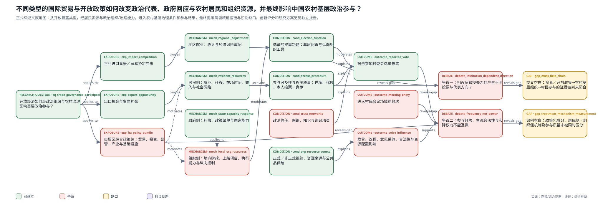

# 国际贸易、政治组织与农村基层政治参与：一项跨层级文献综述

## 一、问题的提出：从贸易的分配后果走向政治组织

国际贸易首先表现为商品、资本与生产要素的跨境流动，但其政治后果并不限于收入增减或选民偏好变化。贸易冲击具有显著的空间集中性：同一轮开放可能给部分地区带来出口、投资和就业机会，也可能使另一些地区承受进口竞争、产业收缩和长期调整成本。地区之间不均衡的经济变化会继续作用于社会结构、财政资源、公共服务以及政治组织的代表和动员基础。因而，真正需要解释的不是“贸易开放是否影响政治”，而是不同类型的开放暴露如何经由居民资源和组织能力进入政治系统，并在何种制度条件下转化为不同形式的政治参与。

这一问题在现有研究中尚未得到完整回答。国际贸易政治经济学已经较充分地讨论进口竞争、产业衰退与党派重组、意识形态极化和民粹主义之间的关系，却主要以欧美竞争性选举为经验场景，并往往将既有政治组织视为承接经济冲击的给定渠道。中国农村治理研究则系统考察了村级选举、组织权威、政治信任、非正式制度和公共品供给，却较少把外部经济开放作为可识别的结构性冲击。两类研究各自成熟，但从“开放政策”到“农村基层组织”再到“村民参与”的证据链仍未闭合。

本文据此按四层逻辑展开综述：首先讨论国际贸易如何改变政治分化、代表关系与组织回应；其次梳理农村基层治理中影响政治参与的制度、资源和组织条件；再次说明贸易活动进入农村的居民侧与组织侧桥梁；最后将文献收束到“外贸下乡—农村基层政治参与”的交叉空白，并说明田皓允工作稿的研究位置。村委会选举投票和村民大会参加次数在这一结构中是因果链末端的经验结果，而不是全文的起始分类。

## 二、文献地图：开放、组织与基层参与的跨层级链条

**图 1　贸易开放、政治组织与农村基层政治参与的文献地图。** 实线所连接的是单篇全文直接支持或多篇全文共同支持的关系；综合关系表示跨研究拼接后的条件性判断；从自贸区综合政策包通往居民资源、组织资源的关系属于本文有待检验的桥梁，而不是既有文献已经确立的因果事实。图中正式综述止于“交叉空白”和“识别空白”，创新候选、评分和研究方案另见独立报告。

地图显示，贸易政治效应不能由一条从开放到投票的直线概括。进口竞争、出口机会与自贸区综合政策包具有不同处理含义；它们可能分别改变地区经济风险、居民就业与迁移、政府补偿能力和基层组织资源。上述变化还要经过选举的制度功能、参与程序、信任与网络、正式和非正式组织等条件，才会表现为投票、进入会议场域或拥有实际发言和资源配置影响。文献分歧因此不只是结论不一致，更来自暴露类型、分析层级、政治制度和结果测量的差异。

## 三、国际贸易如何重塑政治分化、代表关系与组织回应

### （一）贸易冲击的政治方向具有制度依赖性

关于贸易政治后果，最稳固的经验事实不是某一种固定的意识形态方向，而是局部经济冲击会显著进入政治过程。Autor 等利用美国地区受到中国进口竞争的差异，发现贸易暴露加速了温和派代表退出和政治极化，并在部分选举中推动选票向共和党移动[1]。Colantone 和 Stanig 的西欧研究则显示，进口竞争集中地区更容易出现经济民族主义、孤立主义和激进右翼支持[5]。这些研究共同强调，贸易损失不是均匀分布的全国性事件，而是会在特定产业和社区积累为具有政治意义的地方调整成本。

然而，相近的经济冲击并不必然导向同一种政治选择。Che 等研究美国对华永久正常贸易关系政策，发现进口竞争暴露较高的县投票率和民主党支持相对提高；他们将这一变化同选民对贸易限制和经济援助的政策需求联系起来[3]。Choi 等关于北美自由贸易协定的研究进一步指出，持久的地方就业损失只得到有限的转移支付补偿，受冲击地区随后惩罚推动协定的执政党并发生党派联盟重组，而既有种族身份和社会议题立场又调节了这种变化[4]。因此，经济损失要通过责任归因、可用的代表选择和组织化政治供给才会转化为具体投票结果。

Rodrik 将全球化与民粹主义之间的关系概括为经济冲击、身份认同与政治供给相互作用的过程，反对把经济解释和文化解释简单对立[12]。Broz、Frieden 和 Weymouth进一步把“地方”置于全球化反弹的中介位置：贸易与技术冲击不仅影响个人就业，还可能改变社区人口、地方税基、公共服务和社会稳定，继而重组政治组织的支持基础[2]。这类综合研究提示，国际贸易对政治的影响具有明显的空间和组织层次；个体态度只是结果之一，地方社区及其组织能力同样是必须解释的中间环节。

### （二）从选民反应推进到政府能力与政策组织

既有贸易政治研究的重心仍然偏向选民、政党和代表，却已经出现将政府能力纳入分析的尝试。Franco Chuaire、Scartascini 和 Tommasi重新考察开放与政府规模之间的关系，指出外部风险并不只对应“增加支出”这一种补偿方式：官僚和政策能力较弱的国家更可能依赖一般性政府消费，而能力较强的政府能够采用更复杂的保险、监管和调整政策[7]。这一结果的价值在于，它把开放后的政府回应理解为受国家能力约束的“政策菜单”，而不是经济风险对政府规模的机械推动。

从这一角度看，贸易冲击可能同时改变政治组织的需求侧和供给侧。需求侧包括就业、收入、风险感知、身份和政策偏好；供给侧则包括政党或基层组织如何归责、补偿、动员和提供公共服务。Dippel 等关于德国贸易暴露的研究进一步提醒，劳动市场调整是否构成贸易影响投票的因果中介，需要专门的识别假设，不能仅凭就业与投票同时变化便宣布机制成立[6]。这一方法论约束同样适用于中国农村：即使开放政策、村民在场时间、公共品和政治参与在同一边界处变化，也只能先视为相互一致的约化式证据。

还需特别区分进口竞争、出口机会与自贸区政策。欧美文献主要研究负向进口竞争或贸易协定造成的地方损失；中国农村面对的开放则可能表现为出口扩张、非农就业和投资机会。自贸区更是包含贸易便利化、投资准入、监管改革、产业集聚、基础设施和行政协同的综合政策包。因此，国外进口冲击研究能够证明“开放的地方化经济后果会进入政治过程”，却不能预先决定中国自贸区边界内政治参与的方向，也不能把自贸区估计量解释为纯粹的贸易效应。

## 四、农村基层治理中政治参与的制度、资源与组织基础

### （一）选举的制度效能取决于真实权力和资源来源

中国农村选举既是村民授权和监督干部的制度渠道，也嵌入党政体系的纵向组织关系。Zhang 等发现，民选干部、预算透明和权力分享与较低农户税费负担及较好的公共品供给存在系统联系[15]。张同龙、张林秀进一步区分名义投票、意愿投票和完整投票，指出更完整的参与同村庄自筹公共投资关系最为稳定，而对上级投资的解释力较弱[20]。这说明投票是否“值得参与”，不仅取决于选举规则，也取决于村级组织对何种资源拥有实际影响。

Martinez-Bravo 等把农村选举理解为一种组织工具：在上级官僚能力有限时，选举可以利用村民的地方信息监督干部，并帮助政府实施受欢迎的政策；当区域政府资源和纵向控制能力增强后，自治空间又可能收缩[8]。该研究解释了为何治理绩效改善与选举渠道相对弱化可以并存，但不能直接推出自贸区必然强化村党组织或削弱村委会。对具体村庄而言，仍需区分村党支部、村委会和上级政府之间的正式职权、事实决策权及财政来源。

### （二）投票参与受在场资源、程序质量和制度效能共同制约

农村投票率并不是一个同质指标。Pang 和 Rozelle 对中国村级选举程序的研究表明，名义投票率可能掩盖本人填票、本人投箱、代投和咨询等环节上的参与差异，女性、迁移者和迁移女性更容易在真实程序中处于不利位置[10]。Pang、Zeng 和 Rozelle 在宁夏开展的培训研究又显示，权利知识提高并未稳定转化为实际投票，家庭约束、文化规范和村庄制度环境仍会阻断“知情—行动”的转化[11]。因此，教育或信息不是参与的充分条件，迁移和程序可及性也不能被一个“是否投票”的二元变量完全覆盖。

迁移尤其连接了农村经济结构与政治参与。Zhang、Zheng 和 Zhang利用中国劳动力动态调查比较返乡迁移者与农村非迁移者，发现前者更少参加基层选举，并将其中相当部分解释为主动弃权；农业依赖下降和对村委会选举重要性的评价降低，是与该结果相符的解释[16]。这一观察性证据不能证明贸易开放经迁移导致弃权，却直接表明，当家庭经济利益逐渐脱离村庄时，村级选举的预期效能和参与吸引力可能下降。

### （三）信任、网络与非正式组织塑造动员和问责

除资源和程序外，基层参与还受信任与社会组织结构影响。孙昕等基于全国代表性调查发现，乡镇层级政治信任、组织成员身份与村民选举参与存在系统关联，而社会信任的关系更为复杂[18]。由于该研究使用横截面调查，且部分信任量表的内部一致性有限，其结论适合说明信任和组织网络是重要相关因素，而不宜写成“信任导致投票”的单向因果关系。

农村公共品研究进一步揭示，不同组织结构可以通过不同机制改善治理。Tsai 指出，具有广泛覆盖且嵌入地方政府结构的连带群体能够形成非正式问责，促使干部回应公共需求[13]；Xu 和 Yao 则发现，宗族更可能通过融资、承诺和集体行动促进公共投资，而非普遍加强对正式干部的问责[14]。这意味着，组织存在、社会资本、非正式问责和集体融资不能互换，公共品改善也不能反推某一种政治参与机制已经增强。

### （四）参与频次、主观合法性与实际影响必须分开

农村政治参与并不限于选举，但不同渠道测量的政治含义不同。Olken 在印度尼西亚村级公共品项目中随机比较代表会议与全民表决，发现直接表决显著提高知识、满意度和合法性感知，却对最终项目选择的影响相对有限[9]。该结果说明，进入程序、认可程序和改变资源配置是三个不同层次。相应地，村民大会参加次数能够直接说明村民进入某类正式会议场域的频率，却不能单独证明其拥有议程设置、独立发言、意见采纳或实际决策权。

因此，农村基层参与至少应区分四个维度：制度可及性、实际进入、表达与审议、意见对资源配置的影响。村委会选举投票与村民大会参加次数都主要位于前两个维度。若不补充本人投票、会议召集者、议题、发言、采纳和项目决策资料，就不能把投票下降等同于民主倒退，也不能把会议增加等同于自治深化。

## 五、“外贸下乡”：从经济活动到基层治理的双重桥梁

### （一）居民侧：就业、迁移、收入与在场时间

贸易活动进入农村的第一条路径是家庭经济资源和空间配置。陈思宇、陈斌开的研究显示，出口冲击能够通过外出务工、移民网络和家庭收入变化降低农村贫困[17]；王光栋、左家玲也报告了经济全球化与农村非农就业之间的长期联动，但其宏观时间序列识别较弱，主要适合作为背景证据[19]。这些研究共同说明，开放并非只改变农村收入水平，还会改变村民在哪里工作、与谁建立网络以及一年中有多少时间留在村庄。

这种变化对政治参与具有方向相反的可能后果。一方面，收入改善和信息扩展可能增强表达能力；另一方面，外出就业和经济利益外向化会提高参加村级事务的时间成本，并降低某些村庄制度对家庭福利的边际重要性。Pang 和 Rozelle 对迁移者投票程序的研究以及 Zhang、Zheng 和 Zhang 对返乡迁移者政治疏离的研究，为“迁移—参与可及性/制度效能”的连接提供了直接桥梁[10][16]。不过，现有研究尚未在同一因果设计中识别“贸易机会—迁移—村级参与”的完整链条。

### （二）组织侧：地方资源、政策执行与参与供给

开放进入农村的第二条路径是政府和基层组织资源。国际证据表明，国家能力会调节开放风险的政策回应[7]；农村治理研究则表明，选举、财政透明、纵向控制、非正式组织和资源来源会改变公共品供给与自治功能[8][13][14][15]。将两组文献连接起来，可以提出一个尚待检验的组织侧命题：综合开放政策可能通过产业和财政资源、上级项目、行政协调和公共服务改变基层组织的执行能力与动员需求，进而改变会议等参与渠道的供给。

这条桥梁目前不能被写成既有事实。道路硬化、垃圾处理或干部评价属于治理产出或主观评价，并不是会议实际召开、组织动员或事实权力的直接测量。若要识别组织侧路径，需要进一步观察村级财政来源、项目数量、会议召开次数、召集者、议题设置、干部任务和党组织—村委会的签批权。否则，公共品和会议参与同时增加至多说明结果与“组织供给扩张”相容。

### （三）居民侧与组织侧可能同时作用

居民侧与组织侧不是相互排斥的解释。开放可以使村民因非农就业而减少日常在村时间，同时使基层组织因项目、服务和政策执行而更频繁地召集村民；收入改善、信任提升和公共品增加也可能同选举参与下降并存。其政治含义不是参与总量简单增加或减少，而是不同渠道的成本、供给和预期效能发生相对变化。

这一双重框架也解释了为何不能从国外贸易冲击研究直接推断中国农村结果。在竞争性政党制度中，经济不满可通过更换执政党或支持激进政党表达；在中国农村，开放后的政治反应则可能更多地经过村党组织、村委会、上级项目和会议动员。制度环境决定经济变化可以通过哪些组织渠道被表达和吸收。

## 六、交叉空白与本文的研究位置

经过上述梳理，现有研究形成了两条相邻但没有闭合的证据链。第一条是“贸易暴露—地区经济调整—投票、代表和政府回应”，其准实验证据较强，但主要来自欧美进口竞争，并较少直接观察基层组织结构。第二条是“村庄制度、资源、信任与组织—投票、公共品和参与质量”，其对中国农村制度语境解释较深入，却通常把开放、出口和产业变化当作背景。当前检索范围内尚未发现一项同构研究，能够同时识别综合开放政策如何改变中国农村居民资源与村级组织资源，并进一步影响多个基层参与渠道。

田皓允的工作稿以中国自贸区边界为经验场景，正处在两条文献的交叉点。它考察的不是纯关税下降，而是边界附近自贸区综合政策暴露的局部约化效应；投票和会议的方向差异则提供了观察参与渠道变化的入口。工作稿发现，边界内村民报告参加村委会选举投票的概率下降，而参加村民大会的次数增加；全年在村时间、权威认知、信任和公共品结果又呈现若干与居民侧和组织侧机制相符的变化。这些结果可以被审慎地概括为“基层参与渠道出现结构性分化”，但尚不能把政策后变量解释为已经识别的因果中介。

这一研究位置包含三层推进。其一，对贸易政治经济学而言，它把政治结果从党派选择、民族主义和代表极化推进到农村基层组织与参与渠道。其二，对农村治理研究而言，它把外部开放政策作为一种可能同时改变居民与组织资源的结构性暴露。其三，在测量上，它提示投票和会议并非可以加总的同质参与：一个偏向周期性授权，另一个可能兼具信息、协商、项目协调和行政动员功能。

与此同时，本文的识别边界必须保持清楚。自贸区边界可能与行政区、开发区、交通条件和既有产业梯度重合，就业和公共服务也可能跨边界溢出；空间断点设计因此需要政策前协变量连续性、边界重叠剔除、伪边界与 donut 检验、边界段异质性、空间或村级聚类以及政策暴露时长分析。只有在这些条件得到支持后，估计量才能被解释为可比边界附近的综合政策局部效应，而不能外推为所有贸易开放或所有中国农村的平均效应。

## 七、结论

现有文献已经确认，国际贸易的经济后果具有地方性，并能够通过责任归因、代表选择、身份认同和政府回应进入政治过程；但其方向取决于开放类型、政治供给、国家能力和地方社会结构。农村治理研究进一步表明，基层参与不是单纯的个人意愿，而是由真实权力、资源来源、在场条件、程序质量、信任网络和组织动员共同塑造。把两组文献联系起来后，“外贸下乡”的政治后果应被理解为居民资源与组织资源同时重配的过程。

因此，贸易开放与农村基层政治参与之间最值得研究的并不是一个普遍的正负效应，而是开放如何改变不同参与渠道的可及性、组织供给和制度效能。田皓允工作稿的价值正在于把自贸区综合政策、农村居民的经济与空间重组、基层组织的治理活动以及投票和会议两类结果置于同一经验框架。其最稳健的研究位置不是宣称“贸易开放降低民主参与”，而是检验开放条件下农村基层政治参与是否发生渠道层面的结构重组，并进一步区分这种重组来自居民退出、组织吸纳，还是两者的共同作用。

## 参考文献

[1] AUTOR D, DORN D, HANSON G, et al. Importing political polarization? The electoral consequences of rising trade exposure[J]. American Economic Review, 2020, 110(10): 3139-3183. DOI: 10.1257/aer.20170011.

[2] BROZ J L, FRIEDEN J, WEYMOUTH S. Populism in place: The economic geography of the globalization backlash[J]. International Organization, 2021, 75(2): 464-494. DOI: 10.1017/S0020818320000314.

[3] CHE Y, LU Y, PIERCE J R, et al. Does trade liberalization with China influence U.S. elections?[J]. Journal of International Economics, 2022, 139: 103652. DOI: 10.1016/j.jinteco.2022.103652.

[4] CHOI J, KUZIEMKO I, WASHINGTON E L, et al. Local economic and political effects of trade deals: Evidence from NAFTA[J]. American Economic Review, 2024, 114(6): 1540-1575. DOI: 10.1257/aer.20220425.

[5] COLANTONE I, STANIG P. The trade origins of economic nationalism: Import competition and voting behavior in Western Europe[J]. American Journal of Political Science, 2018, 62(4): 936-953. DOI: 10.1111/ajps.12358.

[6] DIPPEL C, GOLD R, HEBLICH S, et al. Instrumental variables and causal mechanisms: Unpacking the effect of trade on workers and voters[R]. Cambridge, MA: National Bureau of Economic Research, 2017. NBER Working Paper 23209. DOI: 10.3386/w23209.

[7] FRANCO CHUAIRE M, SCARTASCINI C, TOMMASI M. State capacity and the quality of policies: Revisiting the relationship between openness and the size of government[R]. Washington, DC: Inter-American Development Bank, 2014. Working Paper 532. DOI: 10.18235/0011652.

[8] MARTINEZ-BRAVO M, PADRÓ I MIQUEL G, QIAN N, et al. The rise and fall of local elections in China[J]. American Economic Review, 2022, 112(9): 2921-2958. DOI: 10.1257/aer.20181249.

[9] OLKEN B A. Direct democracy and local public goods: Evidence from a field experiment in Indonesia[J]. American Political Science Review, 2010, 104(2): 243-267. DOI: 10.1017/S0003055410000079.

[10] PANG X, ROZELLE S. A vote of confidence? Voting protocol and participation in China's village elections[R]. Stanford, CA: Freeman Spogli Institute for International Studies, 2007.

[11] PANG X, ZENG J, ROZELLE S. Learning but not acting in rural China: Women in the Ningxia Autonomous Region, voting rights training, and voting behavior in village elections[J]. Asian Survey, 2014, 54(6): 1009-1036. DOI: 10.1525/as.2014.54.6.1009.

[12] RODRIK D. Why does globalization fuel populism? Economics, culture, and the rise of right-wing populism[J]. Annual Review of Economics, 2021, 13(1): 133-170. DOI: 10.1146/annurev-economics-070220-032416.

[13] TSAI L L. Solidary groups, informal accountability, and local public goods provision in rural China[J]. American Political Science Review, 2007, 101(2): 355-372. DOI: 10.1017/S0003055407070153.

[14] XU Y, YAO Y. Informal institutions, collective action, and public investment in rural China[J]. American Political Science Review, 2015, 109(2): 371-391. DOI: 10.1017/S0003055415000155.

[15] ZHANG X, FAN S, ZHANG L, et al. Local governance and public goods provision in rural China[J]. Journal of Public Economics, 2004, 88(12): 2857-2871. DOI: 10.1016/j.jpubeco.2003.07.004.

[16] ZHANG Z, ZHENG B, ZHANG H. Migration experience, hukou status, and political alienation in Chinese grassroots elections[J/OL]. Journal of Ethnic and Migration Studies, 2026: 1-22. DOI: 10.1080/1369183X.2026.2621838.

[17] 陈思宇, 陈斌开. 贸易、就业与中国农村贫困[J]. 改革, 2020(9): 80-93.

[18] 孙昕, 徐志刚, 陶然, 等. 政治信任、社会资本和村民选举参与——基于全国代表性样本调查的实证分析[J]. 社会学研究, 2007(4): 165-187. DOI: 10.19934/j.cnki.shxyj.2007.04.008.

[19] 王光栋, 左家玲. 经济全球化对中国农村劳动力非农就业的影响[J]. 世界农业, 2011(10): 99-102.

[20] 张同龙, 张林秀. 从民主选举到公共投资：投票细节与作用机制——基于全国5省100村调查数据的经验研究[J]. 经济学（季刊）, 2017, 16(2): 729-748. DOI: 10.13821/j.cnki.ceq.2017.01.12.
